# 第一章 开发前言

## 1.1 Java语言概述

### 什么是Java语言

Java语言是美国Sun公司（Stanford University Network），在1995年推出的高级的编程语言。所谓编程语言，是计算机的语言，人们可以使用编程语言对计算机下达命令，让计算机完成人们需要的功能。

### Java语言发展历史

- 1995年Sun公司发布Java 1.0版本
- 1997年发布Java 1.1版本
- 1998年发布Java 1.2版本
- 2000年发布Java 1.3版本
- 2002年发布Java 1.4版本
- 2004年发布Java 5版本  (更新力度较大)
- 2006年发布Java 6版本
- 2009年Oracle甲骨文公司收购Sun公司，并于2011发布Java 7版本
- 2014年发布Java 8版本  (更新力度较大)
- 2017年9月发布Java 9.0版本
- 2018年3月发布Java 10版本

### Java语言能做什么

Java语言主要应用在互联网程序的开发领域。常见的互联网程序比如天猫、京东、物流系统、网银系统等，以及服务器后台处理大数据的存储、查询、数据挖掘等也有很多应用。


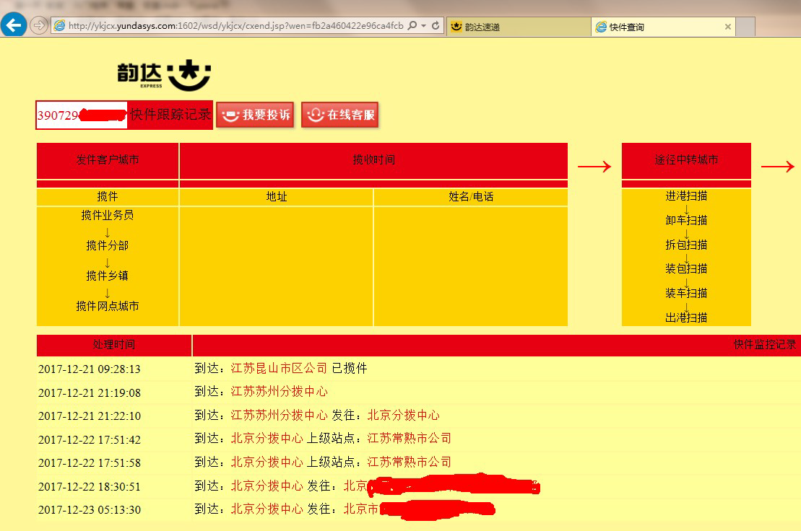


## 1.2 计算机基础知识

### 二进制

计算机中的数据不同于人们生活中的数据，人们生活采用十进制数，而计算机中全部采用二进制数表示，它只包含0、1两个数，逢二进一，1+1=10。每一个0或者每一个1，叫做一个bit（比特）。
下面了解一下十进制和二进制数据之间的转换计算。

- **十进制数据转成二进制数据：**使用除以2获取余数的方式

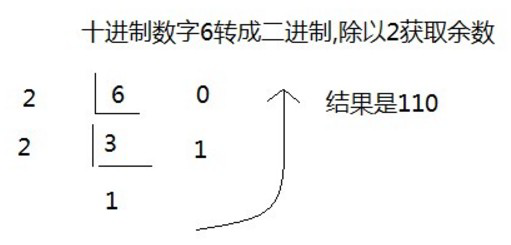

- **二进制数据转成十进制数据：**使用8421编码的方式

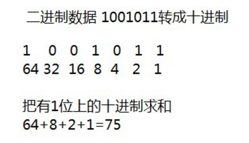

> 小贴士：
> 二进制数系统中，每个0或1就是一个位，叫做bit（比特）。

### 字节

字节是我们常见的计算机中最小存储单元。计算机存储任何的数据，都是以字节的形式存储，右键点击文件属性，我们可以查看文件的字节大小。
8个bit（二进制位） 0000-0000表示为1个字节，写成**1 byte**或者**1 B**。

- 8 bit = 1 B
- 1024 B =1 KB
- 1024 KB =1 MB
- 1024 MB =1 GB
- 1024 GB = 1 TB

### 常用DOS命令

Java语言的初学者，学习一些DOS命令，会非常有帮助。DOS是一个早期的操作系统，现在已经被Windows系统取代，对于我们开发人员，目前需要在DOS中完成一些事情，因此就需要掌握一些必要的命令。

- 进入DOS操作窗口

  - 按下Windows+R键盘，打开运行窗口，输入cmd回车，进入到DOS的操作窗口。

    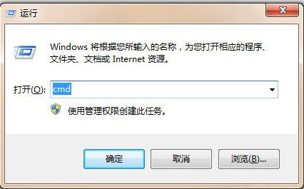

  - 打开DOS命令行后，看到一个路径 c:\user 就表示我们现在操作的磁盘是c盘。

    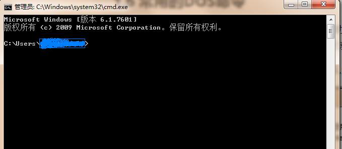

- **常用命令**

| 命令             | 操作符号                     |
| :--------------- | ---------------------------- |
| 盘符切换命令     | `盘符名:`                    |
| 查看当前文件夹   | `dir`                        |
| 进入文件夹命令   | `cd 文件夹名`                |
| 进入多级文件夹   | `cd 文件夹1\文件夹2\文件夹3` |
| 退出文件夹命令   | `cd ..`                      |
| 退出到磁盘根目录 | `cd \`                       |
| 清屏             | `cls`                        |
| 退出             | `exit`                       |


# 第二章 Java语言开发环境搭建

## 2.1 Java虚拟机——JVM

- JVM（Java Virtual Machine ）：Java虚拟机，简称JVM，是运行所有Java程序的假想计算机，是Java程序的运行环境，是Java 最具吸引力的特性之一。我们编写的Java代码，都运行在JVM 之上。

- 跨平台：任何软件的运行，都必须要运行在操作系统之上，而我们用Java编写的软件可以运行在任何的操作系统上，这个特性称为Java语言的跨平台特性。该特性是由JVM实现的，我们编写的程序运行在JVM上，而JVM运行在操作系统上。

  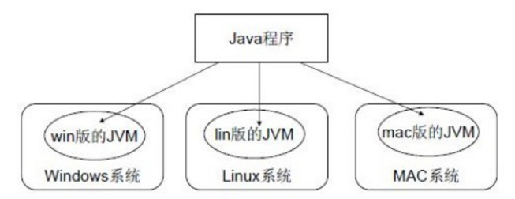

如图所示，Java的虚拟机本身不具备跨平台功能的，每个操作系统下都有不同版本的虚拟机。

## 2.2 JRE 和 JDK

- **JRE** (Java Runtime Environment) ：是Java程序的运行时环境，包含`JVM` 和运行时所需要的`核心类库 `。

- **JDK** (Java Development Kit)：是Java程序开发工具包，包含`JRE`和开发人员使用的工具。

我们想要运行一个已有的Java程序，那么只需安装`JRE` 即可。
我们想要开发一个全新的Java程序，那么必须安装`JDK` 。

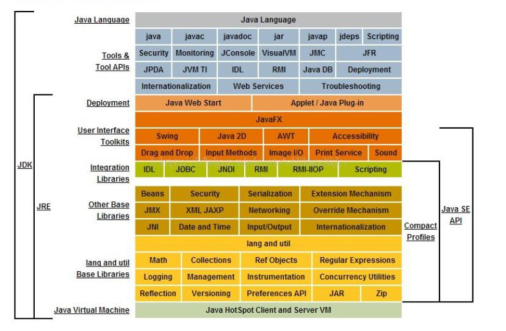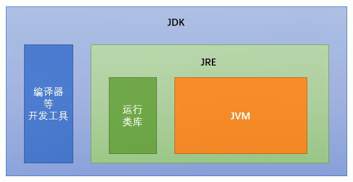

> 小贴士：
> 三者关系： JDK > JRE > JVM

## 2.3 JDK9安装图解

一般情况下默认安装即可，默认路径为C:\Program Files\Java，如要修改路径，需要修改jdk和jre在同一目录下。

> 小贴士：
> 安装路径中，不要包含中文和空格。

## 2.4 JAVA_HOME环境变量的配置

### 配置环境变量作用

开发Java程序，需要使用JDK中提供的工具，工具在JDK9安装目录的bin 目录下。

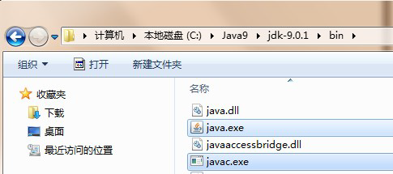

在DOS命令行下使用这些工具，就要先进入到JDK的bin目录下，这个过程就会非常的麻烦。

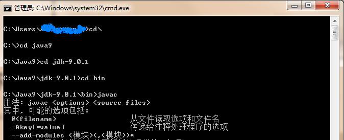

不进入JDK的bin 目录，这些工具就不能使用，会报错。

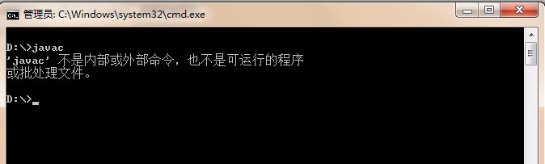

为了开发方便，我们想**在任意的目录下都可以使用JDK的开发工具**，则必须要配置环境变量，配置环境变量的意义在于告诉操作系统，我们使用的JDK开发工具在哪个目录下。

### 配置环境变量步骤

#### Windows 7,8版本

 1. 计算机鼠标右键,选择`属性`

    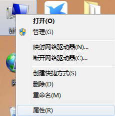

 2. 选择`高级系统设置`

    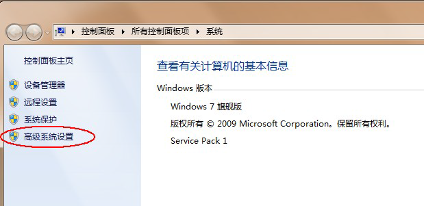

 3. `高级`选项卡，点击`环境变量`

    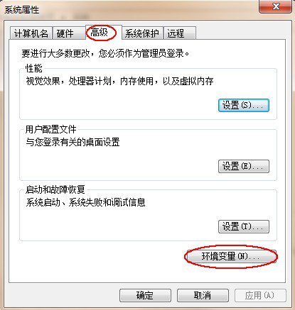

 4. 点击`新建` ，创建新的环境变量

    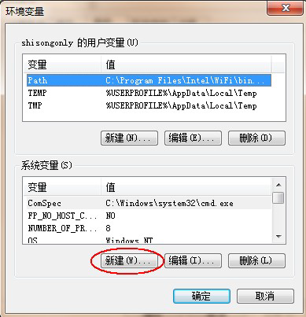

 5. 变量名输入`JAVA_HOME` ，变量值输入JDK9的安装目录 `C:\Program Files\Java\jdk-9.0.1`

    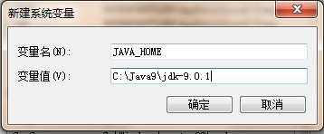

 6. 选中`Path` 环境变量， `双击`或者`点击编辑`

    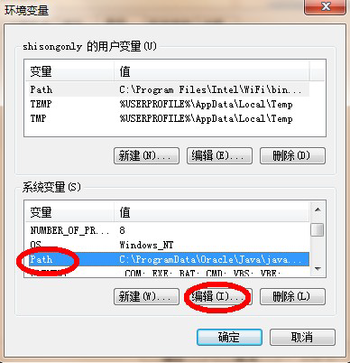

 7. 在变量值的最前面，键入`%JAVA_HOME%\bin;` 分号必须要写，必须是英文格式。

    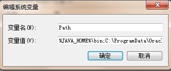

 8. 环境变量配置完成，重新开启DOS命令行，在任意目录下输入`javac`命令，运行成功。

    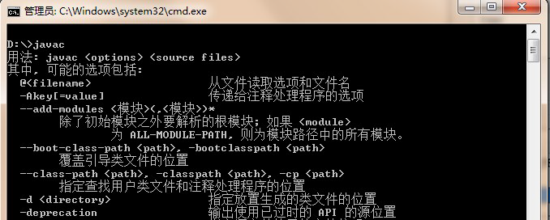

#### Windows 10 版本

1. 文件资源管理器 --> 此电脑鼠标右键 --> 选择`属性`

   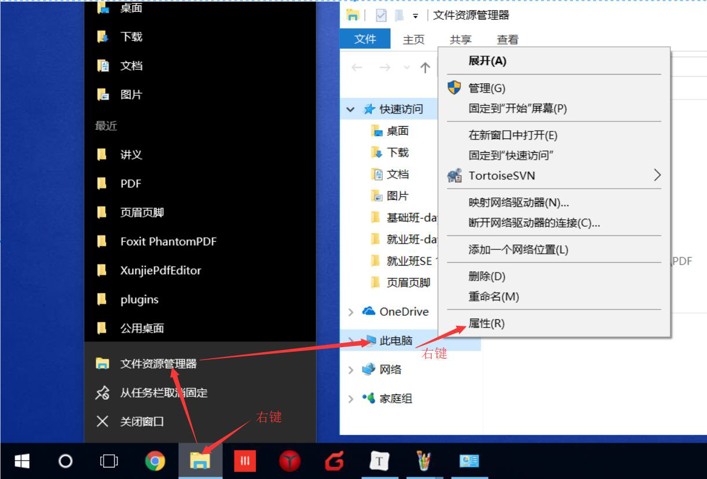

2. 选择`高级系统设置`--> 选择 `环境变量`

   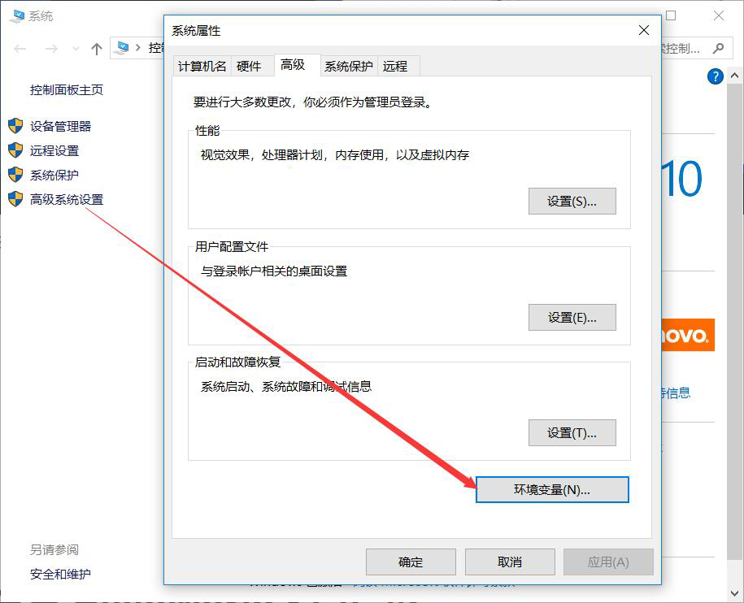

3. 点击下方系统变量的 `新建` ，创建新的环境变量，变量名输入`JAVA_HOME `，变量值输入JDK9的安装目录`D:\02_DevelopTools\Java\jdk-9.0.1`

   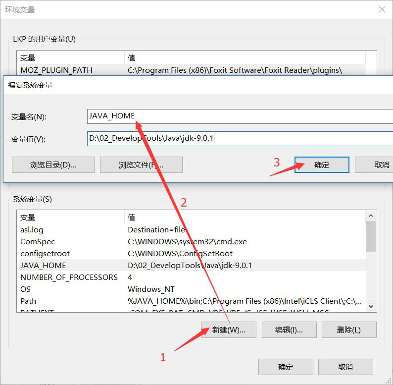

4. 选中`Path` 环境变量， `双击`或者`点击编辑`

   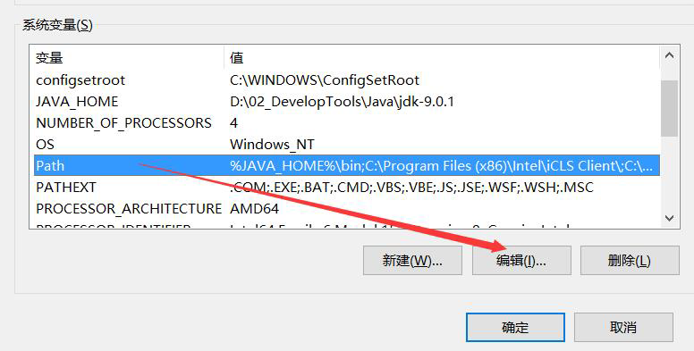

5. 点击`新建`，键入`%JAVA_HOME%\bin`，必须是英文格式。选中该行，上移到最上方，点击确定。

   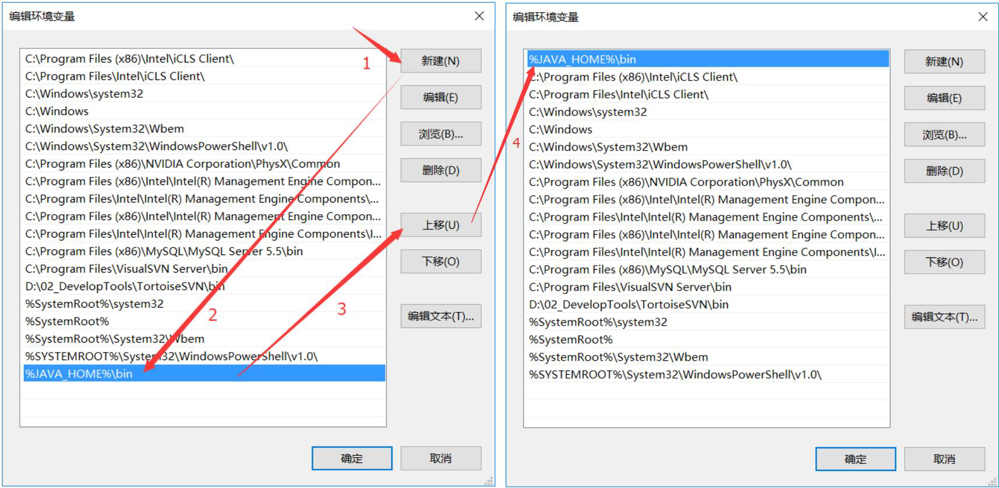

6. 环境变量配置完成，重新开启DOS命令行，在任意目录下输入`javac` 命令。

   

# 第三章 HelloWorld入门程序

## 3.1 程序开发步骤说明

开发环境已经搭建完毕，可以开发我们第一个Java程序了。
Java程序开发三步骤：**编写、编译、运行。**

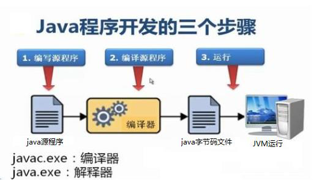

## 3.2 编写Java源程序

1. 在`d:\day01` 目录下新建文本文件，完整的文件名修改为`HelloWorld.java` ，其中文件名为`HelloWorld` ，后
   缀名必须为`.java` 。

2. 用记事本打开

   >  使用notepad++记事本软件。

3. 在文件中键入文本并保存，代码如下：

```java
public class HelloWorld {
	public static void main(String[] args) {
		System.out.println("Hello World!");
	}
}
```

> 文件名必须是`HelloWorld` ，保证文件名和类的名字是一致的，注意大小写。
> 每个字母和符号必须与示例代码一模一样。

第一个`HelloWord` 源程序就编写完成了，但是这个文件是程序员编写的，JVM是看不懂的，也就不能运行，因此我们必须将编写好的`Java源文件` 编译成JVM可以看懂的`字节码文件` 。

## 3.3 编译Java源文件

在DOS命令行中，**进入Java源文件的目录**，使用`javac` 命令进行编译。
命令：

```
javac Java源文件名.后缀名
```

举例：

```
javac HelloWorld.java
```

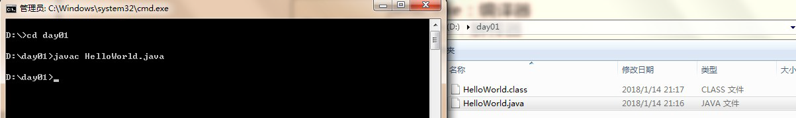

编译成功后，命令行没有任何提示。打开`d:\day01` 目录，发现产生了一个新的文件 `HelloWorld.class` ，该文件就是编译后的文件，是Java的可运行文件，称为**字节码文件**，有了字节码文件，就可以运行程序了。

> Java源文件的编译工具`javac.exe` ，在JDK安装目录的bin目录下。但是由于配置了环境变量，可以再任意目录下使用。

## 3.4 运行Java程序

在DOS命令行中，**进入Java源文件的目录**，使用`java` 命令进行运行。
命令：

```
java 类名字
```

举例：

```
java HelloWorld
```

> java HelloWord 不要写 不要写 不要写 .class

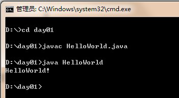

> Java程序`.class`文件 的运行工具`java.exe` ，在JDK安装目录的bin目录下。但是由于配置了环境变量，可以再任意目录下使用。

## 3.5 入门程序说明

### 编译和运行是两回事

- **编译：**是指将我们编写的Java源文件翻译成JVM认识的class文件，在这个过程中，` javac` 编译器会检查我们所写的程序是否有错误，有错误就会提示出来，如果没有错误就会编译成功。
- **运行：**是指将`class文件`交给JVM去运行，此时JVM就会去执行我们编写的程序了。

### 关于main方法

- **main方法：**称为主方法。写法是**固定格式**不可以更改。main方法是程序的入口点或起始点，无论我们编写多少程序，JVM在运行的时候，都会从main方法这里开始执行。

## 3.6 添加注释comment

- **注释：**就是对代码的解释和说明。其目的是让人们能够更加轻松地了解代码。为代码添加注释，是十分必须要的，它不影响程序的编译和运行。
- Java中有单行注释和多行注释
  - 单行注释以` //开头 换行结束`
  - 多行注释以` /*开头 以*/结束`

## 3.7 关键字keywords

- 关键字：是指在程序中，Java已经定义好的单词，具有特殊含义。
  - HelloWorld案例中，出现的关键字有 `public` 、`class` 、`static` 、 `void` 等，这些单词已经被Java定义好，全部都是小写字母，notepad++中颜色特殊。
  - 关键字比较多，不能死记硬背，学到哪里记到哪里即可。

## 3.8 标识符

- **标识符：**是指在程序中，我们自己定义内容。比如类的名字、方法的名字和变量的名字等等，都是标识符。
  - HelloWorld案例中，出现的标识符有类名字`HelloWorld `。

- **命名规则： `硬性要求`**
  - 标识符可以包含`英文字母26个(区分大小写)` 、`0-9数字` 、`$（美元符号）` 和`_（下划线）` 。
  - 标识符不能以数字开头。
  - 标识符不能是关键字。

- **命名规范： `软性建议`**
  - 类名规范：首字母大写，后面每个单词首字母大写（大驼峰式）。
  - 方法名规范： 首字母小写，后面每个单词首字母大写（小驼峰式）。
  - 变量名规范：全部小写。

# 第四章 常量

## 4.1 概述

**常量：是指在Java程序中固定不变的数据。**

## 4.2 分类

| 类型       | 含义                                   | 数据举例                         |
| ---------- | -------------------------------------- | -------------------------------- |
| 整数常量   | 所有整数                               | 0,1,567，-9，···                 |
| 小数常量   | 所有的小数                             | 0.0， -0.1， 2.55，···           |
| 字符常量   | 单引号引起来,只能写一个字符,必须有内容 | 'a' ， ' '， '好'，···           |
| 字符串常量 | 双引号引起来,可以写多个字符,也可以不写 | "A" ，"Hello" ，"你好" ，""，··· |
| 布尔常量   | 只有两个值（流程控制中讲解）           | true ， false                    |
| 空常量     | 只有一个值（引用数据类型中讲解）       | null                             |

## 4.3 练习

需求：输出各种类型的常量。

```java
public class ConstantDemo {
	public static void main(String[] args){
		//输出整数常量
		System.out.println(123);
		//输出小数常量
		System.out.println(0.125);
		//输出字符常量
		System.out.println('A');
		//输出布尔常量
		System.out.println(true);
		//输出字符串常量
		System.out.println("你好Java");
	}
}
```

# 第五章 变量和数据类型

## 5.1 变量概述

**变量：常量是固定不变的数据，那么在程序中可以变化的量称为变量。**

> 数学中，可以使用字母代替数字运算,例如 x=1+5 或者 6=x+5。
>
> 程序中，可以使用字母保存数字的方式进行运算，提高计算能力，可以解决更多的问题。比如x保存5，x也可以保存6，这样x保存的数据是可以改变的，也就是我们所讲解的变量。

Java中要求一个变量每次只能保存一个数据，必须要明确保存的数据类型。

## 5.2 数据类型

### 数据类型分类

Java的数据类型分为两大类：

- 基本数据类型：包括`整数`、`浮点数`、`字符`、`布尔`。
- 引用数据类型：包括`类`、`数组`、`接口`。

### 基本数据类型
四类八种基本数据类型：

| 数据类型     | 关键字       | 内存占用 | 取值范围                                            |
| ------------ | ------------ | -------- | --------------------------------------------------- |
| 字节型       | byte         | 1个字节  | -128~127  (-2<sup>7</sup> ~ 2<sup>7</sup> -1)       |
| 短整型       | short        | 2个字节  | -32768~32767  (-2<sup>15</sup> ~ 2<sup>15</sup> -1) |
| 整型         | int(默认)    | 4个字节  | -2<sup>31</sup> ~ 2<sup>31</sup> -1                 |
| 长整型       | long         | 8个字节  | -2<sup>63</sup> ~ 2<sup>63</sup> -1                 |
| 单精度浮点数 | float        | 4个字节  | 1.4013E-45~3.4028E+38                               |
| 双精度浮点数 | double(默认) | 8个字节  | 4.9E-324~1.7977E+308                                |
| 字符型       | char         | 2个字节  | 0~65535                                             |
| 布尔类型     | boolean      | 1个字节  | true，false                                         |

> Java中的默认类型：整数类型是`int`、浮点类型是`double`。

## 5.3 变量的定义

变量定义的格式包括三个要素：`数据类型`、`变量名`、`数据值`。

### 格式

```java
数据类型 变量名 = 数据值;
```

### 练习

定义所有基本数据类型的变量，代码如下：

```java
public class Variable {
	public static void main(String[] args){
		//定义字节型变量
        byte b = 100;
        System.out.println(b);
        //定义短整型变量
        short s = 1000;
        System.out.println(s);
        //定义整型变量
        int i = 123456;
        System.out.println(i);
        //定义长整型变量
        long l = 12345678900L;
        System.out.println(l);
        //定义单精度浮点型变量
        float f = 5.5F;
        System.out.println(f);
        //定义双精度浮点型变量
        double d = 8.5;
        System.out.println(d);
        //定义布尔型变量
        boolean bool = false;
        System.out.println(bool);
        //定义字符型变量
        char c = 'A';
        System.out.println(c);
	}
}
```

> long类型：建议数据后加L表示。
> float类型：建议数据后加F表示。

## 5.4 注意事项

- 变量名称：在同一个大括号范围内，变量的名字不可以相同。
- 变量赋值：定义的变量，不赋值不能使用。